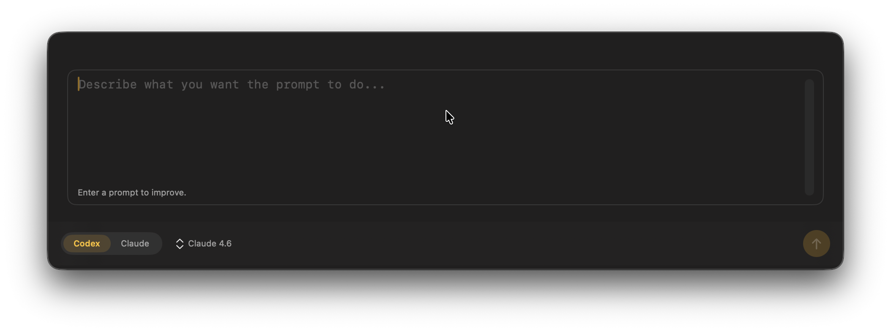
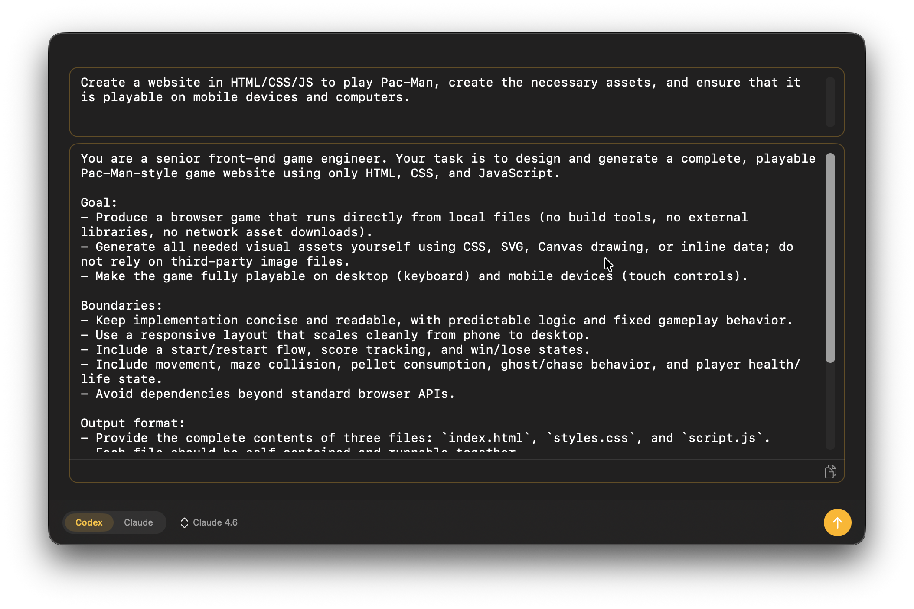
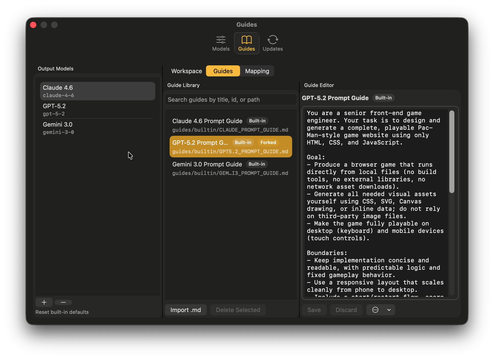
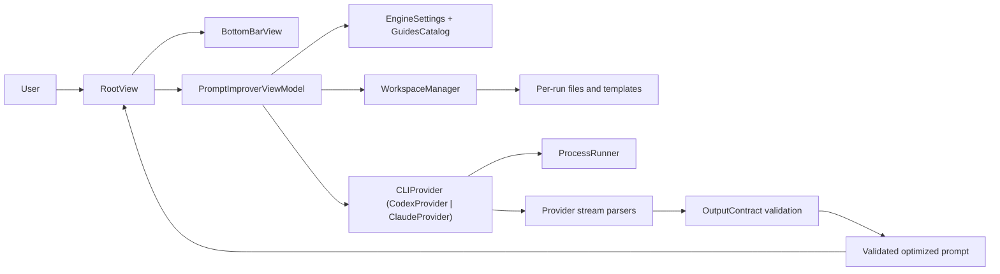

# PromptImprover

Open Source macOS app for local prompt optimization using `codex` and `claude` CLIs, with strict output-contract validation.

[](https://github.com/jnjambrin0/PromptImprover/actions/workflows/release.yml)
[](https://github.com/jnjambrin0/PromptImprover/actions/workflows/release-local.yml)
[](LICENSE)

## Table of Contents

- [Overview](#overview)
- [Demo and visuals](#demo-and-visuals)
- [Key features](#key-features)
- [Quickstart](#quickstart)
- [Install from GitHub Releases](#install-from-github-releases)
- [Configuration](#configuration)
- [Usage](#usage)
- [Output contract](#output-contract)
- [Architecture](#architecture)
- [Release and updates](#release-and-updates)
- [Roadmap](#roadmap)
- [Contributing guidelines](#contributing-guidelines)
- [Code of conduct](#code-of-conduct)
- [Security policy](#security-policy)
- [Funding](#funding)
- [Support](#support)
- [License](#license)

## Overview

PromptImprover is an Open Source native SwiftUI app for improving prompts through local CLI tools (`codex`, `claude`) instead of direct API integrations from the app.

Project status: Initial production phase, ready for real user usage.

Current stability expectations:
- The core prompt-improvement flow is implemented and test-covered.
- Settings, guide management, and release/update workflows are active and evolving.
- Internal implementation details may continue to evolve as production adoption grows.

Primary users:
- Prompt engineers and AI power users who already operate local `codex` or `claude` CLIs.
- macOS developers who want a local-first prompt workflow with explicit runtime behavior.

## Demo and Visuals








## Key Features

- Single-window prompt workflow with input, tool selection, output-model selection, run/stop, and copy output actions.
- Local CLI orchestration for `codex` and `claude`.
- Strict output contract: only a valid `{"optimized_prompt":"..."}` payload is accepted, then normalized to plain prompt text.
- Prompt guide system with built-in guides, user guide import (`.md`), and ordered guide mapping per output model.
- In-app guide editor with built-in fork, save, discard, and revert-to-built-in flow.
- Local capability detection and per-tool engine model/effort configuration.
- Sparkle 2 integration for non-App-Store updates, including install-location checks and move/relaunch flow.

## Quickstart

### Prerequisites

- macOS with Xcode installed.
- `codex` and/or `claude` installed and authenticated in Terminal.

### Build

```bash
/Applications/Xcode.app/Contents/Developer/usr/bin/xcodebuild \
  -project PromptImprover.xcodeproj \
  -scheme PromptImprover \
  -configuration Debug \
  -sdk macosx build
```

### Test

```bash
swift test
```

Optional live CLI smoke tests:

```bash
PROMPT_IMPROVER_RUN_CLI_SMOKE=1 swift test --filter CLISmokeTests
```

Optional runtime-contract smoke tests with real CLIs + prompt capture wrappers:

```bash
PROMPT_IMPROVER_RUN_CLI_RUNTIME_CONTRACT=1 swift test --filter CLISmokeTests
```

### Run the app

```bash
open PromptImprover.xcodeproj
```

Then run the `PromptImprover` scheme in Xcode.

## Install from GitHub Releases

PromptImprover releases are published on GitHub and include installable DMG artifacts.

- Releases page: [github.com/jnjambrin0/PromptImprover/releases](https://github.com/jnjambrin0/PromptImprover/releases)
- Current public path is the non-Developer-ID distribution while project funding is still limited.

### Install steps

1. Download the latest `.dmg` from the Releases page.
2. Open the DMG.
3. Drag `PromptImprover.app` into `/Applications`.
4. Launch `PromptImprover` from `/Applications`.

### Important first-launch note (current limitation)

Current builds may be blocked by macOS Gatekeeper because they are not yet distributed with an Apple Developer ID certificate/notarization.

If launch is blocked:
1. Open `System Settings` -> `Privacy & Security`.
2. Find the blocked app notice for `PromptImprover`.
3. Allow/Open the app from that panel (the button label can appear as `Open Anyway`).
4. Launch the app again.

This is expected for the current release phase. The project plans to move to full Developer ID signed/notarized distribution when funding allows.

## Configuration

### Runtime behavior

- Tool choice: `Codex CLI` or `Claude Code`.
- Target output model: selected independently from tool choice.
- Engine model and effort settings: configured per tool in Settings -> Models.
- Capability detection: local-only (`--version` / `--help`) with cached binary signatures.

### Guides

Settings -> Guides supports:
- Output model CRUD (`displayName`, `slug`).
- Ordered guide mapping per output model.
- Guide import (Markdown only).
- In-app guide editing and built-in fork/revert.

Guide import validation:
- Extension must be `.md`.
- File must be valid UTF-8.
- Max file size is `1,048,576` bytes (1 MiB).

### Storage layout

PromptImprover stores state under standard macOS locations:

- `~/Library/Application Support/PromptImprover/`
  - `settings.json`
  - `model-mapping.json`
  - `guides/builtin/`
  - `guides/user/`
  - `guides/user/forks/`
  - `diagnostics/`
- `~/Library/Caches/PromptImprover/`
  - `cli-discovery-cache.json`
  - `rag-index/`
  - `thumbnails/`
- Temporary root (`FileManager.temporaryDirectory`)
  - `.../PromptImprover/run-<uuid>/` per-run workspace

## Usage

1. Enter the source prompt in the input editor.
2. Select a tool (`Codex` or `Claude`).
3. Select the target output model.
4. Click Improve.
5. Review the validated optimized prompt output.
6. Click Copy.

Runtime controls:
- Stop cancels the in-flight process.
- Process timeout defaults to 120 seconds.

## Output Contract

PromptImprover only accepts final output that matches this JSON shape:

```json
{
  "optimized_prompt": "non-empty string"
}
```

Validation rules:
- Exactly one key: `optimized_prompt`.
- Non-empty value after trimming.
- Fenced output and explanatory wrappers are rejected.

## Architecture

### Runtime flow

1. Create a per-run workspace and write `INPUT_PROMPT.txt` + internal `RUN_CONFIG.json`.
2. Copy only tool-relevant static templates and schema into the workspace.
3. Run the selected CLI provider with provider-specific arguments and environment handling.
4. Parse streamed/final responses and validate against the output contract.
5. Display only validated optimized prompt text in the UI.

### Architecture diagram (Mermaid)



### Code map

- `PromptImprover/App` - app entry, root view, main view model.
- `PromptImprover/UI` - screen components and settings views.
- `PromptImprover/Core` - domain models, contracts, stores, errors.
- `PromptImprover/CLI` - discovery, health checks, capability detection/cache.
- `PromptImprover/Execution` - process runner and stream buffering.
- `PromptImprover/Providers` - `codex` / `claude` adapters and parsers.
- `PromptImprover/Workspace` - ephemeral run workspace assembly.
- `PromptImprover/Updates` - Sparkle update manager and install-location logic.
- `PromptImprover/Resources/templates` - guide/templates/schema artifacts.
- `Tests/Unit`, `Tests/Fixtures` - unit tests and fixtures.

## Release and Updates

PromptImprover uses Sparkle 2 for non-App-Store updates.

Release paths:

1. Local non-notarized path (current practical path):

```bash
SKIP_PUBLISH=1 scripts/release/release-local.sh
```

Default CI/local settings for this path:
- `LOCAL_DISABLE_CODE_SIGNING=1`
- `LOCAL_MACOSX_DEPLOYMENT_TARGET=15.0`
- `LOCAL_ADHOC_SIGN_APP=1`

2. Developer ID + notarized path (production-oriented):

```bash
scripts/release/release.sh
```

Minimum prerequisites:
- Sparkle private key for signed appcast generation.
- For notarized path: Developer ID certificate and notary credentials.

Manual local DMG smoke helper:

```bash
scripts/dev/make_local_dmg.sh
```

For full operational detail, review `scripts/release/` and `.github/workflows/`.

## Roadmap

- Add a dedicated CI test workflow for PR-level test signaling.
- Enable full Developer ID signed + notarized public distribution when project funding allows.
- Expand release installation guidance once signed/notarized distribution is enabled.

## Contributing Guidelines

Contributions are welcome.

- Contributor workflow and standards: [CONTRIBUTING.md](CONTRIBUTING.md)
- Pull request checklist/template: [.github/pull_request_template.md](.github/pull_request_template.md)

## Code of Conduct

Community participation standards and incident reporting process:

- [CODE_OF_CONDUCT.md](CODE_OF_CONDUCT.md)

## Security Policy

Security reporting and disclosure policy:

- [SECURITY.md](SECURITY.md)
- Private vulnerability reporting: [GitHub Security Advisories](https://github.com/jnjambrin0/PromptImprover/security/advisories/new)

## Funding

Funding metadata is configured in `.github/FUNDING.yml` (`buy_me_a_coffee: jnjambrin0`).

- Support the project: [Buy Me a Coffee](https://www.buymeacoffee.com/jnjambrin0)
- Funding config file: [.github/FUNDING.yml](.github/FUNDING.yml)

## Support

- Support policy: [SUPPORT.md](SUPPORT.md)
- Questions, bugs, and feature requests: [GitHub Issues](https://github.com/jnjambrin0/PromptImprover/issues)

Support is currently managed through GitHub Issues only.

## License

PromptImprover is Open Source software licensed under the Apache License 2.0. See [LICENSE](LICENSE).
